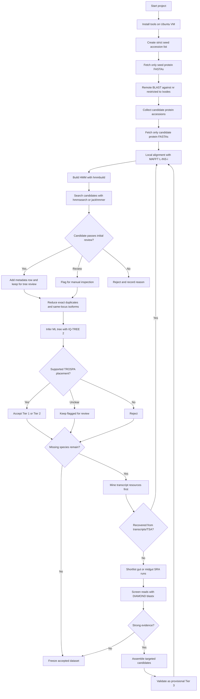

# TROSPA pipeline flowchart

This diagram is designed to explain the workflow to a beginner and to reinforce the project's remote-first philosophy.

## Mermaid source

## Interpretation

The central idea is simple:

- stay remote as long as possible
- retrieve only small accession-based FASTA files first
- use local alignment, HMM, and tree review for curation
- use transcript and SRA rescue only for remaining gaps
- keep provisional evidence separate until validated

## Website structure recommendation

If you turn this into GitHub Pages later, keep the navigation simple:

- Home: `README.md`
- Install: `docs/onboarding.md`
- Workflow: `docs/sop.md`
- Flowchart: `docs/flowchart.md`

That is enough for a clean documentation site.
